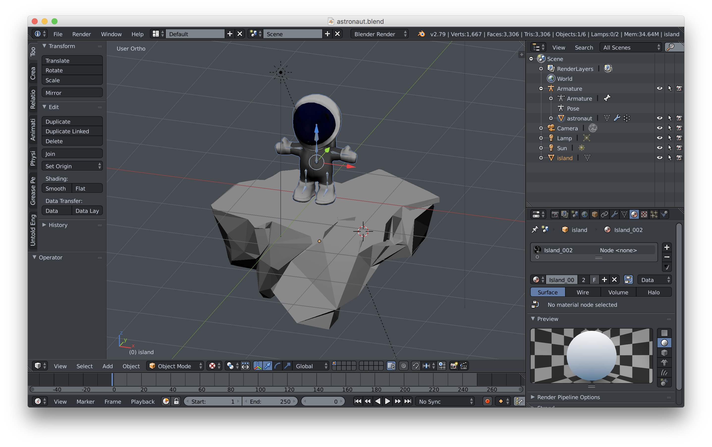
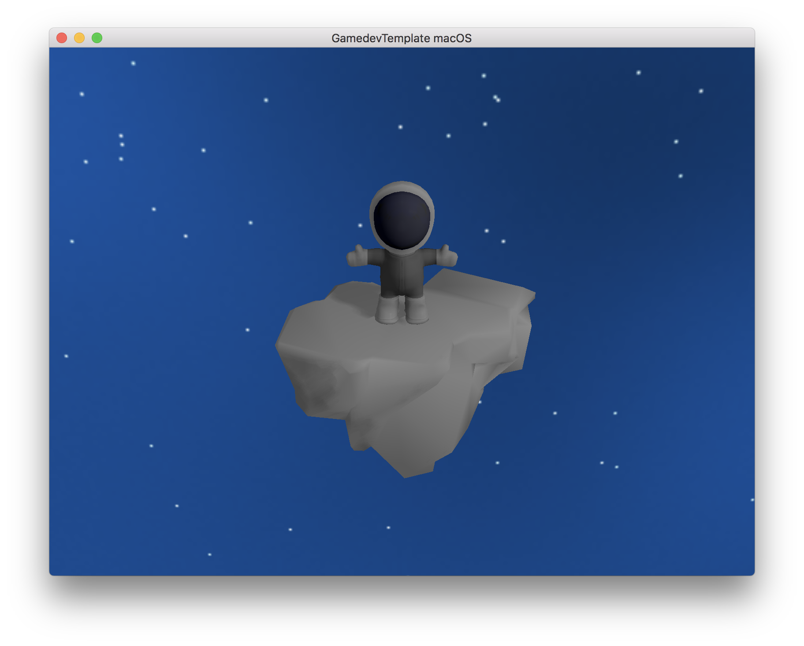
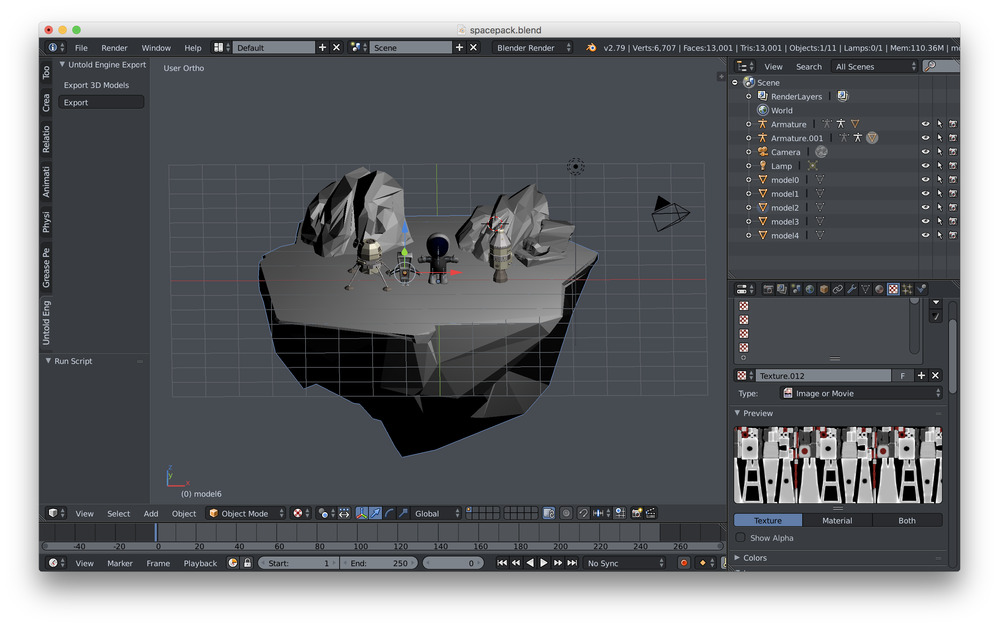
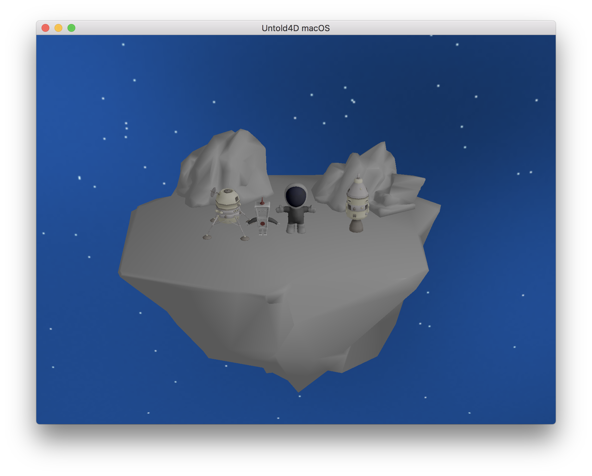
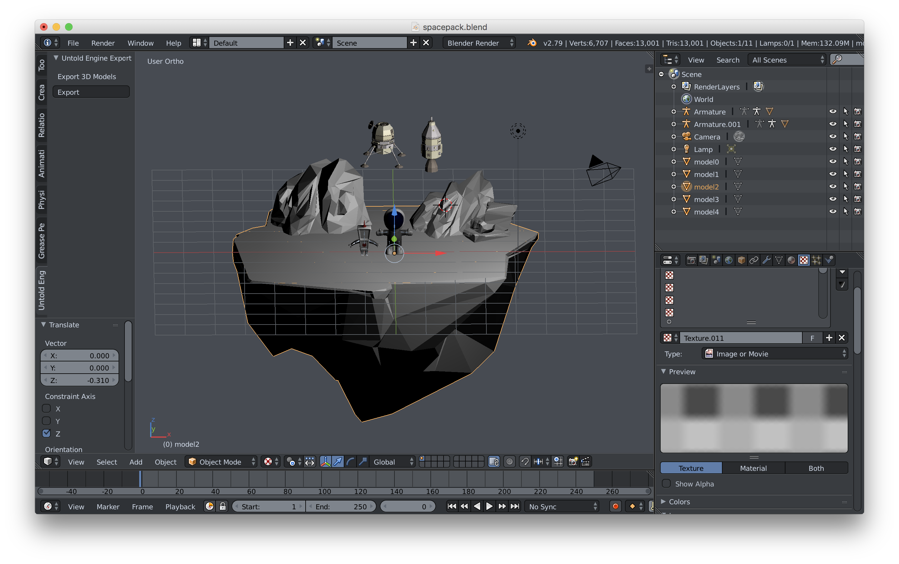
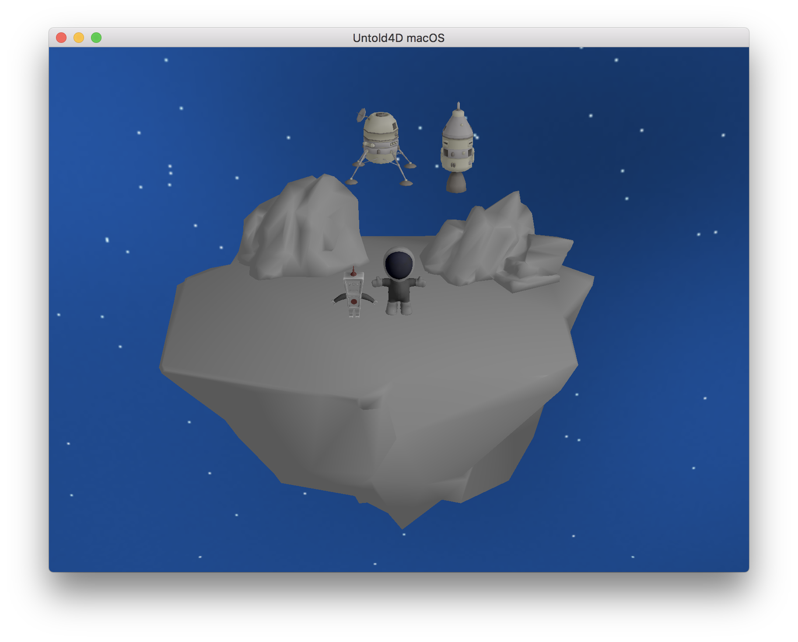

# Digital Asset Exporter

The Digital Asset Exporter (DAE) is a Blender 3D plugin developed to work specifically with the [Untold Engine](http://www.untoldengine.com).

The DAE allows a game developer to extract the rendering data from a 3D object modeled in Blender 3D. For example, the following model was created in Blender 3D.

By executing the DAE, and providing the output file to the Untold Engine, the engine can recreate the model in an iOS or macOS device.

Aside from extracting rendering and animation information, the DAE provides an easy way to set up your game scene. The DAE can obtain the location and rotation of every object in Blender 3D. For example, the image below shows the objects in a particular location:

The DAE provides this information to the engine. The Untold Engine then positions each object accordingly.

If you decide to modify the locations of game objects in Blender 3D

The DAE will reflect this changes and provide the engine the new locations, as shown below:

For more information on how to use this plugin, review this [article](http://www.untoldengine.com/blog/user-guide-import-a-3d-model-with-the-dae).